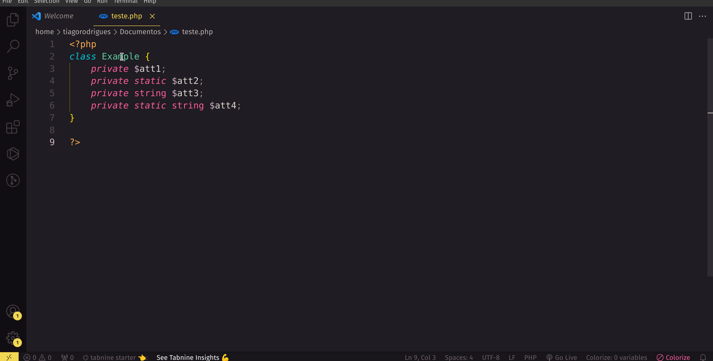
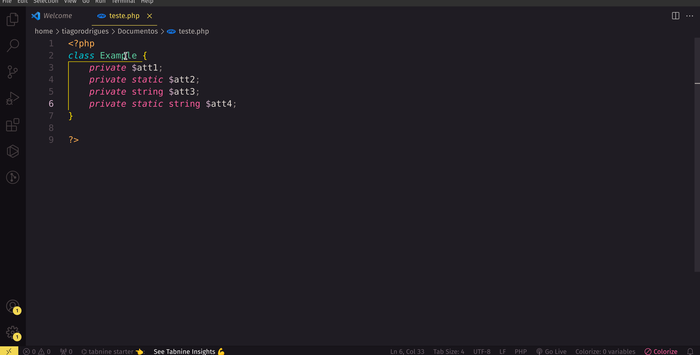

# ClassCraft PHP

<div align="center">


</div>

> Gerador de métodos getters e setters para classes PHP.

## Features

Esta extensão permite que você crie os métodos getters e setters a partir dos atributos de um classe PHP, apenas selecionando seu nome;



## Requirements

- O arquivo deve ser um arquivo PHP;
- Você deve selecionar o nome da classe que quer gerar os métodos (uma classe por vez);
- Os atributos devem estar todos juntos;

## Dont's

### Atributos separados

```php
<?php
    class Example {
        private $prop1;
        private $prop2;

        private $prop3;
    }
?>
```

### Atribuições mal formatadas

```php
<?php
    class Example {
        private $prop1 = 0; # this is ok
        private $prop2= 2; # this is not ok
        private $prop3="classcraft"; # this is not ok
    }
?>
```

## Usage

1. Selecione o nome de uma classe;
2. A seguir, realize um dos seguintes passos:
    1. Clique com o botão direito e selecione uma das opções;
    2. Use o atalho `Ctrl` + `Shift` + `p`; digite ClassCraft PHP e selecione uma das opções.

### Demos
Exemplo do item 2.i


Exemplo do item 2.ii


## Release Notes

### 1.0.0

Initial version